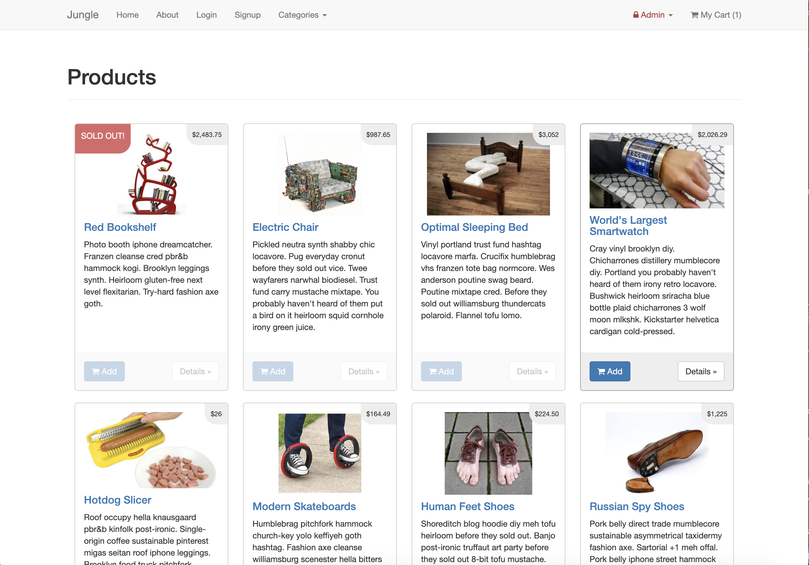
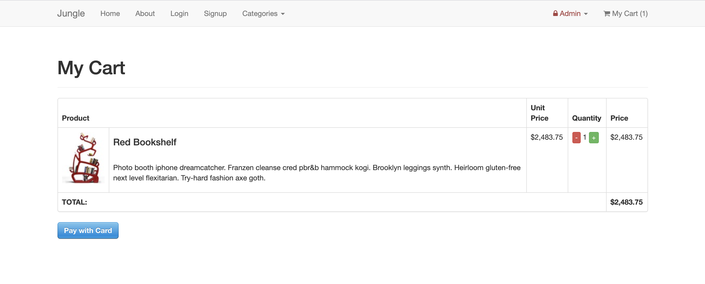
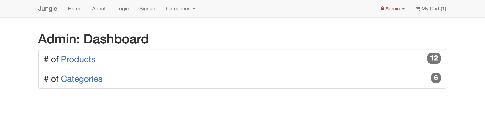

# Jungle

A mini e-commerce application built with Rails 4.2 for purposes of teaching Rails by example.

## Description
Jungle is a rails application designed to showcase products for sale, all the way from browsing to checkout. Select an item, add to cart, and make a purchase! Works like any buy/sell website. Admin users can add or delete products, and can add categories as the admin sees fit. 

## Setup

1. Run `bundle install` to install dependencies
2. Create `config/database.yml` by copying `config/database.example.yml`
3. Create `config/secrets.yml` by copying `config/secrets.example.yml`
4. Run `bin/rake db:reset` to create, load and seed db
5. Create .env file based on .env.example
6. Sign up for a Stripe account
7. Put Stripe (test) keys into appropriate .env vars
8. Run `bin/rails s -b 0.0.0.0` to start the server

## Stripe Testing

Use Credit Card # 4111 1111 1111 1111 for testing success scenarios.

More information in their docs: <https://stripe.com/docs/testing#cards>

## Dependencies

* Rails 4.2 [Rails Guide](http://guides.rubyonrails.org/v4.2/)
* PostgreSQL 9.x
* Stripe

